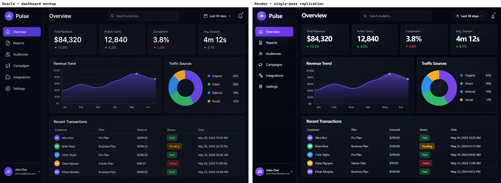
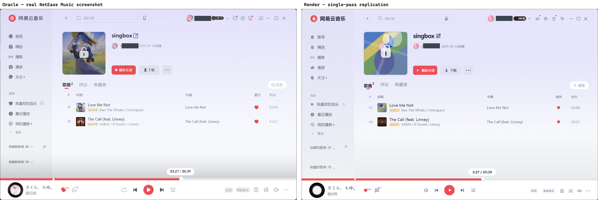

<div align="center">

*Explicit coordinates, inspectable image evidence, and one repeatable replication workflow.*


<a href="LICENSE"></a>

<br>
<br>

<a href="#quick-start">Quick Start</a> ｜
<a href="#core-idea">Core Idea</a> ｜
<a href="#key-features">Features</a> ｜
<a href="#command-line">CLI</a> ｜
<a href="#visual-evidence--replication-workflows">Examples</a> ｜
<a href="#project-structure">Structure</a> ｜
<a href="#documentation">Docs</a>

<a href="README.zh-CN.md">中文</a>

</div>

---

`@mapleluvr/visual-primitives` ships one unified package containing:

- the workflow-agnostic `vp` (and `visual-primitives`) CLI for turning explicit boxes and points into inspectable image evidence; and
- six Agent Skills for generic visual evidence and frontend replication workflows.

Node.js 22.18 or newer is required. There is no background daemon or hidden continuation session. Every command executes locally
and deterministically against provided image files, performs one bounded image processing
operation, prints a structured JSON receipt to `stdout`, and exits immediately.

> [!IMPORTANT]
> `visual-primitives` turns explicit coordinates into local visual evidence artifacts (`.png`
> crops, labeled preview overlays, exact color samples). It does **not** perform object
> detection, OCR, segmentation, automatic box generation, or blind UI inference. Coordinates are
> provided by human users or reasoning agents, and direct visual inspection remains the authoritative
> interpreter of all generated artifacts.

## Core Idea

<a id="evidence-model"></a>

`visual-primitives` treats spatial evidence as a verifiable contract:

1. **Normalized vs. Pixel Coordinates**: Normalized coordinates (`0..999`) provide resolution-independent references across varied device viewports. Pixel coordinates provide exact 1:1 hardware buffer mapping.
2. **Deterministic Resolution**: Bounding boxes undergo scaling, origin conversion, optional padding, and clamping in a single deterministic pipeline.
3. **Clamping Transparency**: Every receipt exposes both `resolvedPixelBox` (the actual crop rectangle) and `unclampedPixelBox`, with a boolean `clamped` flag indicating whether any boundary was clipped.
4. **Fail-Fast Batching**: In `crop-multi`, if any box fails validation or exceeds bounds under `--no-clamp`, zero files are written and the process exits with code `2` or `1`.
5. **No Blind State**: Commands do not create background locks, temporary database records, or hidden sessions. Output paths are deterministic or explicitly specified.

## Key Features

- **Evidence-bound inspection**: generate concrete, pixel-accurate crops and previews from explicit
  coordinates to anchor visual reasoning in verifiable facts rather than hallucination.
- **Pure local & zero daemon**: standalone CLI powered by `sharp` and native `libvips`; executes
  in-process with zero background services, zero network calls, and instant startup.
- **Dual coordinate spaces**: supports paper-style normalized `0..999` thousandths (following
  *Thinking with Visual Primitives*) as well as direct pixel coordinates.
- **Flexible coordinate geometry**: supports standard top-left origin or Cartesian bottom-left
  (y growing upward), with `left-top-right-bottom` (`ltrb`) or `left-bottom-right-top` (`lbrt`) tuples.
- **Atomic fail-fast batching**: `vp crop-multi` crops multiple labeled regions in one call; if
  any coordinate or box is invalid, the operation aborts cleanly without partial files.
- **CSS-level color precision**: `vp colors` samples points or odd $N \times N$ pixel patches,
  returning RGB, Hex, OKLab color space coordinates, and patch mean statistics for design matching.
- **Discoverable Agent Skill Set**: six portable agent skills (compatible across agent
  harnesses including Pi, Claude Code, Cursor, and others) covering standalone visual evidence,
  oracle intake, parent-agent loops, subagent orchestration, verdict synthesis, and delivery review.
- **Masked Oracle Diff engine**: dedicated workflow helper comparing oracle reference designs
  against rendered implementations, strictly isolating code-drawable UI from approved image exclusions.
- **Dual input modes**: ergonomic CLI flags for interactive shell use, plus `--json <file|->`
  for machine pipelines and programmatic invocation.
- **Predictable machine contracts**: versioned JSON receipts on `stdout`, human summaries on
  `stderr` (suppressible with `--quiet`), and fixed exit codes (`0` success, `1` runtime/IO, `2` usage).

## Quick Start

### Requirements

- Node.js 22.18 or newer
- Linux, macOS, or Windows
- Interactive terminal or headless automation environment
- Optional: Any coding agent harness supporting Agent Skills (e.g. [Pi](https://github.com/earendil-works/pi), Claude Code, Cursor) for agent-driven replication

### Installation

#### CLI Installation (npm)

Install both binary aliases (`vp` and `visual-primitives`) globally from npm:

```bash
npm install -g @mapleluvr/visual-primitives
vp --help
visual-primitives --version
```

The two aliases are completely equivalent.

#### Install The Skill Set In Pi

Skills follow the open Agent Skills standard and are portable across agent harnesses.
In Pi, install the package directly to load the six visual replication and evidence skills:

```bash
# Pinned npm version
pi install npm:@mapleluvr/visual-primitives@0.2.0

# Or pinned Git release tag
pi install git:github.com/mapleluvr/visual-primitives@v0.2.0
```

> [!NOTE]
> The Pi package manifest exposes **Skills only**. It intentionally does not register legacy
> extension tools. Because Pi package installation does not guarantee npm binaries are on the
> system `PATH`, agent skills automatically invoke the bundled CLI through `skills/_shared/run-vp.mjs`.
> Humans may use the globally installed `vp` binary.

### Getting Started

Create a working directory and copy a screenshot at least `1440 × 900` into it as `screenshot.png` before running these coordinate examples. For other dimensions or layouts, adjust the boxes and points first; these are supplied coordinates, not detected elements.

```bash
mkdir vp-demo
cd vp-demo
```

#### 1. Annotate Assumptions on a Preview

Draw labeled bounding boxes over the source image to verify coordinate assumptions before drawing conclusions:

```bash
vp annotate screenshot.png \
  --box "header:0,0,1440,80:#00aaff" \
  --box "sidebar:0,80,260,900:#ff0055" \
  --box "content:260,80,1440,900" \
  --out preview.png
```

#### 2. Crop a Focused Region

Crop an exact rectangular bounding box for detailed visual inspection:

```bash
vp crop screenshot.png --box "40,30,240,180" --out header-card.png
```

For normalized paper-style coordinates (0..999 thousandths):

```bash
vp crop screenshot.png --box "28,33,167,200" --space normalized-999 --out header-card.png
```

#### 3. Batch-Crop Multiple Regions

Crop multiple labeled areas in a single atomic call. Files are named deterministically using the provided labels:

```bash
vp crop-multi screenshot.png \
  --out-dir ./crops \
  --box "logo:20,20,120,60" \
  --box "search-bar:160,20,600,60" \
  --box "user-avatar:1380,20,1420,60"
```

#### 4. Crop Around a Point of Interest

Extract a square or rectangular neighborhood centered on an explicit coordinate:

```bash
# Using radius (crops a 160x160 square centered at 500, 300)
vp point screenshot.png --point "500,300" --radius 80 --out target-center.png

# Using explicit width x height
vp point screenshot.png --point "500,300" --size 120x80 --out target-rect.png
```

#### 5. Sample CSS and OKLab Colors

Sample exact pixel colors or mean patch colors to achieve precise CSS styling:

```bash
vp colors screenshot.png \
  --patch 3 \
  --point "bg:10,10" \
  --point "brand-red:420,280" \
  --point "text-primary:100,50"
```

#### 6. Pipeline with JSON Input

Use `--json` to pass complete structured payloads from files or `stdin`:

```bash
vp crop --json crop-spec.json
cat crop-spec.json | vp crop --json -
```

```json
{
  "imagePath": "screenshot.png",
  "box": [40, 30, 240, 180],
  "coordinateSpace": "pixel",
  "outputPath": "header.png"
}
```

### Read the Receipt

```bash
vp annotate screenshot.png --box "header:40,30,240,180" --out annotated.png
vp crop screenshot.png --box "40,30,240,180" --out header.png
vp colors screenshot.png --point "header-bg:80,50" --patch 3
```

Every successful command writes one structured JSON receipt to `stdout` (with summaries on `stderr`):

```json
{
  "imagePath": "/workspace/screenshot.png",
  "outputPath": "/workspace/header.png",
  "source": {
    "width": 1440,
    "height": 900,
    "format": "png"
  },
  "input": {
    "box": [40, 30, 240, 180],
    "coordinateSpace": "pixel",
    "origin": "top-left",
    "boxOrder": "left-top-right-bottom",
    "padding": 0,
    "clamp": true
  },
  "resolvedPixelBox": {
    "left": 40,
    "top": 30,
    "right": 240,
    "bottom": 180,
    "width": 200,
    "height": 150
  },
  "unclampedPixelBox": {
    "left": 40,
    "top": 30,
    "right": 240,
    "bottom": 180,
    "width": 200,
    "height": 150
  },
  "clamped": false
}
```

For automated agent or headless workflows, `--json <file|->` accepts full JSON inputs via file
or `stdin`, preserving legacy tool payload schemas and default normalized coordinates.

## Command Line

| Command | Purpose |
| --- | --- |
| `vp crop <image> --box <l,t,r,b> [options]` | Crop one rectangular region from a source image. |
| `vp crop-multi <image> --box <[label:]l,t,r,b> ...` | Crop multiple labeled regions atomically in one fail-fast call. |
| `vp annotate <image> --box <[label:]l,t,r,b[:color]> ...` | Draw labeled boxes and outlines on a same-size preview image. |
| `vp point <image> --point <x,y> (--radius <n> \| --size <WxH>)` | Crop a rectangular region centered on an explicit coordinate. |
| `vp colors <image> --point <[label:]x,y> ...` | Sample exact pixel or patch colors (RGB, Hex, OKLab, patch mean). |

### Common Options

| Option | Values | Default | Description |
| --- | --- | --- | --- |
| `-i, --image <path>` | File path | Positional 1 | Source image path (supports PNG, JPEG, WebP, AVIF, TIFF, GIF, SVG). |
| `-s, --space <space>` | `pixel` \| `normalized-999` | `pixel` | Coordinate interpretation (`px`, `999` aliases accepted). |
| `--origin <origin>` | `top-left` \| `bottom-left` | `top-left` | Coordinate origin (`bottom-left` means y grows upward). |
| `--box-order <order>` | `ltrb` \| `lbrt` | `ltrb` | Coordinate order (`left-top-right-bottom` or `left-bottom-right-top`). |
| `--padding <n>` | Non-negative integer | `0` | Additional pixel margin expanded around resolved boxes. |
| `--no-clamp` | Flag | Clamping on | Fail on out-of-bounds boxes instead of clipping to image dimensions. |
| `--json <file\|->` | File path or `-` | None | Read full input payload as JSON; ignores other input flags. |
| `--compact` | Flag | Pretty | Output compact single-line JSON instead of indented JSON. |
| `-q, --quiet` | Flag | Verbose | Suppress the human-readable summary line on `stderr`. |
| `-h, --help` | Flag | None | Display global or command-specific usage help. |
| `-v, --version` | Flag | None | Display the installed package version. |

### Exit Codes

| Exit Code | Meaning | Standard Output | Standard Error |
| :---: | --- | --- | --- |
| `0` | Success | Structured JSON receipt | One-line summary (unless `--quiet`) |
| `1` | Runtime / Image / IO failure | Empty | Descriptive error message |
| `2` | Usage / Validation error | Empty | Help hint or schema error message |

## Visual Evidence & Replication Workflows

Frontend UI is meant to be looked at, so these examples are shown, not merely scored.
The following real-world examples were produced in a single pass by a mid-tier frontend model
driven through `frontend-replication` $\rightarrow$ `inline-replication`.

The quality comes from strictly running the replication loop rather than raw model capability.
A standard prompt that reliably drives the loop:

```text
Replicate the frontend screenshot at <path> (viewport <W>x<H>). Follow the
frontend-replication workflow strictly.

- Match the oracle's exact pixel dimensions in the rendered screenshot.
- Render every code-drawable region in code (CSS/SVG): text, table columns,
  icons, badges, status pills, progress bars, and brand colors.
- Approved exclusions may be represented by placeholders or delegated image assets:
  avatars, album / cover art, organic illustrations, and dense logo marks.
- Keep code-drawable content inside the scoring domain; use exclusions only for
  tightly bounded regions that cannot be described as boxes and paths.
```

### Worked Example 1: Fast and Accurate Dashboard Mockup

The oracle is an analytics dashboard mockup featuring a regular grid layout: a navigation sidebar,
a top KPI row, two visual chart cards, and a recent transactions table.

<p align="center">
  
</p>

<p align="center"><em>Left: Oracle mockup (<code>1487x1058</code>). Right: Single-pass render (<code>1487x1058</code>).</em></p>

On a clean, regular layout like this, the workflow achieves high fidelity immediately:
- The sidebar hierarchy, KPI metric cards, revenue area chart, traffic donut chart, and transaction table land accurately.
- Semantic indicators (green up-deltas, red down-deltas, amber pending status pills) reproduce exact hex colors sampled via `vp colors`.
- Both views match pixel-for-pixel on dimensions and major component alignment in a single pass.

### Worked Example 2: Dense Real-World Application (NetEase Cloud Music)

The oracle is an authentic desktop client screenshot (`1448x940`) of NetEase Cloud Music — a dense,
three-region interface featuring multi-size Chinese typography, badge systems (`超清母带`, `VIP`),
a signature brand red, complex column alignment, and a floating playback progress bar.

<p align="center">
  
</p>

<p align="center"><em>Left: Real desktop screenshot oracle (<code>1448x940</code>). Right: Single-pass render (<code>1448x940</code>). Full-resolution images in <a href="docs/visual-primitives/examples/"><code>docs/visual-primitives/examples/</code></a>.</em></p>

#### Exclusion Boundaries vs. Code-Drawable Scoring Domain

The core design principle of `visual-primitives` replication is drawing a strict line between
**what a text model can describe in code** and **organic imagery that requires image assets**:

- **Delegated Exclusions**: Six regions were excluded from code-scoring and delegated to asset placeholders — the playlist cover art, two user avatars, two song thumbnails, and the rotating vinyl record.
- **Code-Drawable Domain**: Everything else stayed strictly in the scoring domain — layout grid, table alignment, badge typography, icon glyphs, search bars, and audio controls.

#### Direct Inspection Findings

Even with this extreme density, the single-pass render holds together with remarkable fidelity. Direct inspection reveals only subtle, small-area details:
1. **NetEase Logo Mark**: The render approximates the brand mark with inline SVG rather than the exact proprietary vector curve.
2. **Progress Bar Knob**: The circular scrubber sits 2 pixels above the red/gray track boundary instead of perfectly centered.
3. **Icon Weights**: Several navigation icons differ by one font-weight step.

The visual evidence tools (`vp annotate`, `vp crop`, `masked-oracle-diff`) identify these exact discrepancies, enabling targeted feedback in the next refinement loop.

## Skill Set

The package includes six discoverable skills for agent-assisted visual engineering.
Built on the open Agent Skills standard, they are portable across coding agent harnesses
(such as Pi, Claude Code, Cursor, and custom agent harnesses):

| Skill | Role | Primary Use Case |
| --- | --- | --- |
| `using-visual-primitives` | General Primitive Guidance | Core tool selection, coordinate systems, preview annotations, and direct visual inspection. |
| `frontend-replication` | Replication Gateway | Oracle intake, run workspace creation, manifest initialization, and routing. |
| `inline-replication` | Parent-Agent Loop | Single-agent end-to-end replication for simple to medium pages. |
| `subagent-driven-replication` | Multi-Agent Orchestration | High-precision replication dividing work among worker and reviewer subagents. |
| `refining-with-feedback` | Iterative Refinement | Synthesizing previous draft history, failed inspections, and diff verdicts into targeted fixes. |
| `finalizing-replication` | Final Quality Gate | Conducting final direct human inspection and user-facing delivery review. |

### Package Launcher

In agent environments, skills invoke the CLI via the cross-platform packaged launcher:

```bash
node <skills-dir>/_shared/run-vp.mjs <command> [options]
```

This guarantees execution regardless of whether global npm binaries are present on the host `PATH`.

## Frontend Workflow Helper: `masked-oracle-diff`

`masked-oracle-diff` remains owned by the frontend replication workflow. It is not a `vp` command,
npm binary, generic core export, or responsibility of `using-visual-primitives`.

When a replication skill is loaded, resolve `scripts/run-masked-oracle-diff.mjs` relative to the
loaded `frontend-replication` skill directory and invoke that package-local runner:

```bash
node <frontend-replication-skill-dir>/scripts/run-masked-oracle-diff.mjs \
  --manifest docs/visual-primitives/runs/<run-id>/scripts/diff-manifest.json
```

*(Repository maintainers working in this repository checkout may also run `npm run oracle:diff -- --manifest <path>`.)*

### Artifact Output

The helper generates a complete diagnostic suite in the run workspace:
- `diff.gray.png`: Visual difference heatmap highlighting discrepancies.
- `mask.png`: Binary mask confirming evaluated vs. excluded regions.
- `matrix.json`: $25 \times 25$ spatial error distribution grid.
- `components/` & `stripes/`: Decomposed component-level diff analysis.
- `summary.json`: Aggregate diff metrics and pass/fail thresholds.
- `VERDICT.md`: Human- and agent-readable markdown verdict.

> [!NOTE]
> A clean diff score opens the door to final direct inspection; it does not certify delivery
> by itself. Direct visual inspection remains mandatory.

## Project Structure

```text
visual-primitives/
├── src/                 # CLI, schemas, crops and color processing
├── skills/              # Six Agent Skills
│   ├── _shared/         # Bundled CLI launcher
│   └── frontend-replication/scripts/ # Masked Oracle Diff
├── scripts/             # Build, package smoke and release checks
├── tests/               # Synthetic image and CLI contract tests
├── docs/                # Designs, worked examples and workflow records
└── assets/              # README title artwork
```

## Replication Run Workspace

Replication workflows organize durable artifacts in a standardized run directory structure:

```text
docs/visual-primitives/runs/<run-id>/
  oracles/       # Source screenshots, reference assets, and oracle-manifest.json
  annots/        # Annotated preview overlays from vp annotate
  cropped/       # Isolated region crops from vp crop and vp crop-multi
  rendered/      # Rendered webpage screenshots from browser captures
  diffs/         # Masked oracle diff images, matrices, and summaries
  drafts/        # Progressive code implementations and draft manifests
  verdict/       # Process feedback verdicts from automated verification runs
  scripts/       # Run-local capture scripts and manifest configurations
  final/         # Final direct-inspection notes and delivery review artifacts
```

## Support and Boundaries

| Capability | Current boundary |
| --- | --- |
| Local image processing | Node.js ≥22.18; Linux / macOS / Windows |
| Coordinate source | Explicit human or agent input; no detection, OCR or automatic segmentation |
| Pi integration | Skills only; no legacy native extension-tool registration |
| Masked Oracle Diff | Owned by the frontend replication workflow, not a `vp` subcommand |
| Scores and acceptance | Diagnostic signals only; final direct visual inspection is still required |
| Runtime state | No daemon or hidden continuation session; artifacts use declared output paths |

## Versioning

The CLI and Skill Set use one package version and one Git tag. Package version `X.Y.Z` corresponds to tag `vX.Y.Z`. Command names, JSON input semantics, exit codes, documented Skill resources, and helper ownership are protected compatibility contracts.

## Migration from `pi-visual-primitives`

Version `0.2.0` represents a complete architectural evolution from the legacy `pi-visual-primitives` package:

1. **Standalone CLI**: Legacy TypeScript extension tools (`crop_bounding_box`, `sample_colors`) are replaced by the high-performance `vp` CLI binary.
2. **Skills-Only Pi Package**: Pi package manifests load skills without registering native runtime extension tools.
3. **Command Mapping**:
   - `crop_bounding_box` $\rightarrow$ `vp crop`
   - `crop_multiple_bounding_boxes` $\rightarrow$ `vp crop-multi`
   - `annotate_bounding_boxes` $\rightarrow$ `vp annotate`
   - `crop_around_point` $\rightarrow$ `vp point`
   - `sample_colors` $\rightarrow$ `vp colors`
4. **Path Independence**: Agents execute via `skills/_shared/run-vp.mjs` without requiring manual system environment configuration.
5. **Workflow Scoping**: `masked-oracle-diff` is properly scoped inside `frontend-replication` rather than cluttering generic primitive tools.

## Documentation

- [Release & Architecture Intent](docs/superpowers/work/vp-cli-skill-set-release/intent.md)
- [Single-Package Architecture Decision](docs/superpowers/work/vp-cli-skill-set-release/decisions/0001-single-package-architecture.md)
- [Package and CLI Contract](docs/superpowers/work/vp-cli-skill-set-release/contracts/package-and-cli-contract.md)
- [Skill Set & Loop Hardening Review](docs/skill-set-loop-review.md)
- [Visual Reproduction Specification](docs/superpowers/specs/2026-07-01-aigc-oracle-web-reproduction-devskillpack-design.md)
- [Conformance Review](docs/conformance-review.md)
- [Release Management Guide](RELEASE.md)
- [Changelog](CHANGELOG.md)

## Development

```bash
# Install dependencies
npm ci --ignore-scripts

# Verify types, builds, and scripts
npm run check

# Execute test suite
npm test

# Run package smoke test (builds tarball, validates CLI, all 6 skills, and launcher)
npm run package:smoke

# Security audit
npm audit --audit-level=high
```

All test suites generate deterministic synthetic image fixtures in memory with `sharp.create()`,
keeping the repository lightweight and free of binary test artifacts.

CI runs continuously across Ubuntu, macOS, and Windows with Node 22.18.0 and Node 24.x.
Publishing is strictly tag-gated using npm Trusted Publishing with cryptographic provenance.

## Safety Model & Evidence Boundaries

- **Strict Schema Admission**: The CLI rejects unknown JSON properties, non-finite coordinates, out-of-range enums, and conflicting parameters.
- **Fail-Closed Processing**: Invalid image headers, unreadable files, or malformed coordinates terminate execution immediately with descriptive diagnostics.
- **Local Image Processing**: Image operations use native libraries without shell expansion or arbitrary script evaluation; this is not a general-purpose security sandbox.

## License

Licensed under the [MIT License](LICENSE).

---

<div align="center">

**State the coordinates. Keep the evidence. Inspect the result.**

</div>
